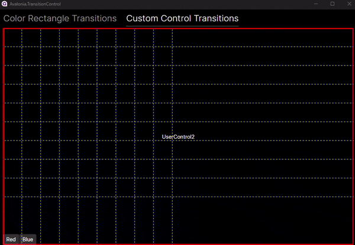

Avalonia.TransitionControl
---
Sample application to demonstrate a custom transition control

- ~~BUG: Flicker of IsVisible property at end of animation~~
- NOTE: By animating the Bounds.X property instead of the TranslateTransform.XProperty, this flicker bug no longer appears.

### Build/Run
- Set the project named "Avalonia.TransitionControl.Desktop" as the startup project in Visual Studio. Then Debug.
- Otherwise use the following in Visual Studio Code from the root folder:
    ```
    > dotnet run --project ./Avalonia.TransitionControl.Desktop/Avalonia.TransitionControl.Desktop.csproj
    ```

